## 一、JVM 调优三部曲
### 性能监控
- GC频繁
- cpu load过高
- OOM
- 内存泄漏
- 死锁
- 程序响应时间过长
### 性能分析
- 打印GC日志(通过GCViewer或者http://gceasy.io来分析日志)
- 灵活应用工具(jstack, jmap, jinfo)
- 导出dump文件，使用分析工具分析文件(JProfiler)
- 使用Arthas，JConsole，JVisualVM来实时查看JVM状态
- jstack查看堆栈信息
### 性能调优
- 适当的加内存，根据业务背景选择合适的垃圾回收器
- 代码优化，控制内存使用
- 增加机器，分散节点压力
- 合理的设置线程池和线程数量
- 使用中间件提高程序效率(消息队列，缓存等)
- 其他

## 二、性能指标
### 停顿时间
提交请求和响应该请求之间使用的时间，一般比较关注平均响应时间；
常用操作响应时间列表：
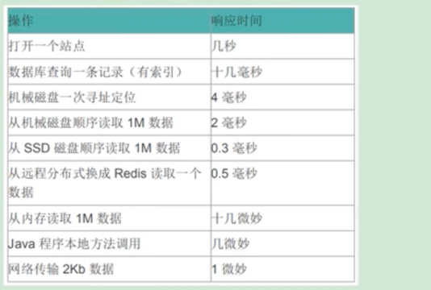

### 吞吐量
对单位时间完成的工作量(请求数量)

### 并发数
同一时刻，对服务器有实际交付的请求数

### 内存占用
Java堆内存占用大小

## 三、JVM命令行监控工具

### `jps(Java Process Status)`：查看正在运行的java进程
基本语法：`jps [options] [hostid]` <br> 
options:
 - -q: 仅仅显示LVMID(Local Virtual machine id), 既本地虚拟机唯一id，不显示主类的名称
 - -l: 输出应用程序主类的全类名，如果应用程序是jar包，就输出jar包的完整路径
 - -m: 输出虚拟机进程启动时，传递给主类的main()的参数
 - -v: 列出虚拟机进程启动时的JVM参数，比如：-Xms20m -Xmx50m是启动程序制定的JVM参数

注意：如果某类Java进程启动的时候关闭了默认开启的UsePerfData参数(-XX:-UsePerfData)，那么jps命令和jstat将无法探知该进程。

### `jstat(JVM Statistics Monitoring Tool)`：查看JVM统计信息
基本语法：`jstat [options] [-t] [-h<lines>] <vmid> [<interval> [<count>]]` <br>

- interval: 用于输出指定统计数据的周期，单位为毫秒，即查询间隔
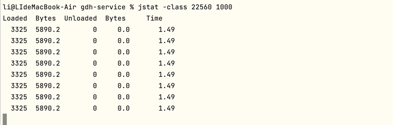

- count: 用于指定查询的总次数
```shell
jstat -class 22560 1000 10
```
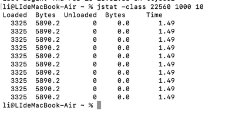

- -t: 可以在输出信息前加一列Timestamp列，用于显示程序运行时间，单位s
```shell
jstat -class -t 22560 1000 10
```
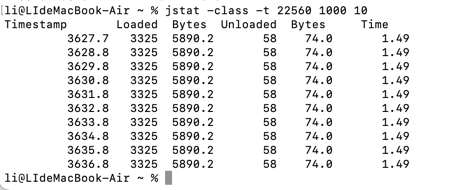

- -h: 每隔多少行打印一次表头
```shell
jstat -class -t -h3 22560 1000 10
```
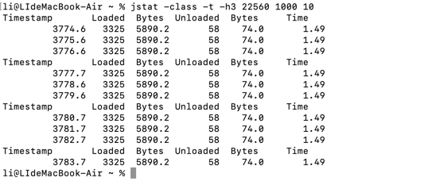

- options:
  - 类装载相关的
    - -class：显示ClassLoader的相关信息：类的装载，卸载数量，总空间，类装载所消耗的时间
  - 垃圾回收相关的
    - -gc：显示gc相关的堆信息(包括Eden区，Survivor区，老年代，永久代等容量、已用空间、GC时间合计等信息)
    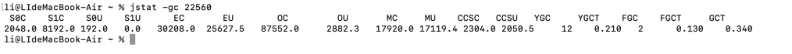
      - SOC：第一个幸存者区大小(字节)
      - S1C：第二个幸存者区大小(字节)
      - S0U: 第一个幸存者区已经使用大小(字节)
      - S1U: 第二个幸存者区已经使用大小(字节)
      - EC：Eden区大小
      - EU： Eden区已经使用大小
      - OC：老年代大小
      - OU：老年代已经使用大小
      - MC：元空间大小
      - MU：元空间已经使用大小
      - CCSC： 压缩类空间大小
      - CCSU: 压缩类空间已使用大小
      - YGC：程序启动YongGC次数
      - YGCT：程序启动YongGC消耗时间(秒)
      - FGC：程序启动来FullGC次数
      - FGCT：程序启动来FullGC耗时(秒)
      - GCT：程序GC总耗时(秒)
    - -gcutil: 显示gc相关堆空间占比情况
    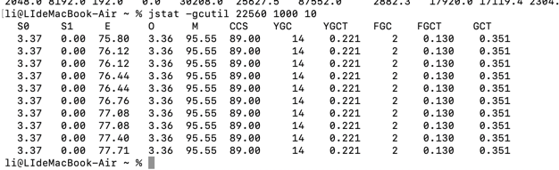
    - gccause: 主要关注gc的原因
    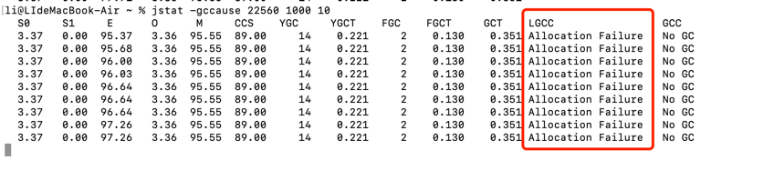
    - -gcnew: 显示新生代gc情况
    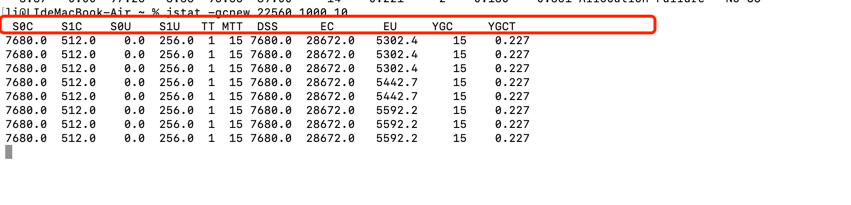
    
  - JIT相关的
    - -compiler: 显示即时编译过的方法和耗时等信息
    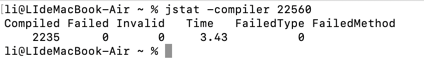
    - -printcompilation: 输出已经被jit编译过的方法
    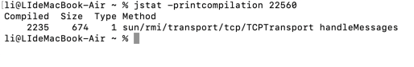

### `jinfo(Configuration info for java)`：实时查看和修改JVM配置参数
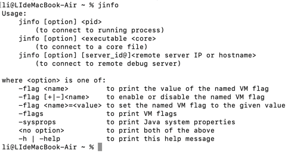
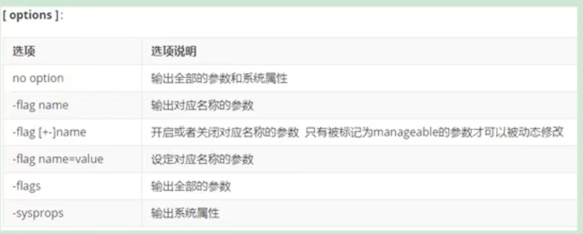
该命令不止可以查看运行时进程的参数，还可以修改manageable标记的flag参数；
可修改的参数如下：
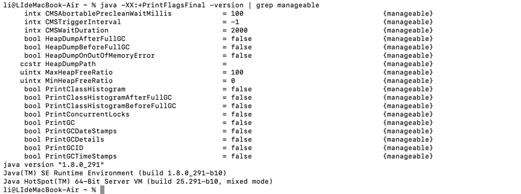

拓展：
 -  `java -XX:+PrintFlagsFinal`：查看所有jvm的最终值
 -  `java -XX:+PrintFlagsInitial`：查看所有JVM启动的初始值
 -  `java -XX:+PrintCommandLineFlags`：查看哪些已经被用户或者JVM设置过的详细的XX的名称和值

### `jmap(JVM Memory map)`：导出内存映射文件和内存使用情况
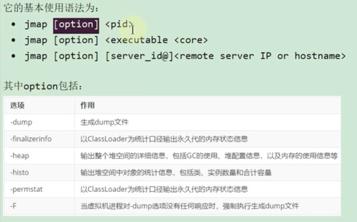
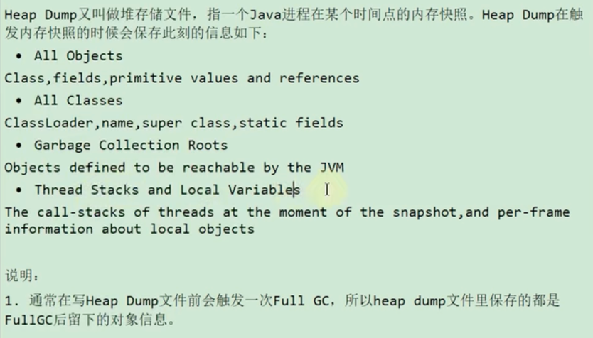
 - 手动导出dump文件：`jmap -dump:format=b,file=./1.hprof <pid>`(-dump:format=b表示是一个标准的文件) 和 `jmap -dump:live,format=b,file=./1.hprof <pid>`(-dump:live表示只保留堆中存活的对象)
 - 自动导出dump文件：`-XX:+HeapDumpOnOutOfMemoryError`(当程序发生OOM时，导出应用程序当前堆快照) `-XX:HeapDumpPath=<filename.hprof>`(指定堆快照保存位置)

### `jhat(JVM Heap Analysis Tool)`：jdk自带的堆分析工具
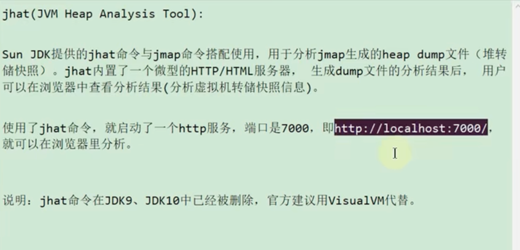

### `jstack(JVM Stack Trace)`：打印JVM线程快照
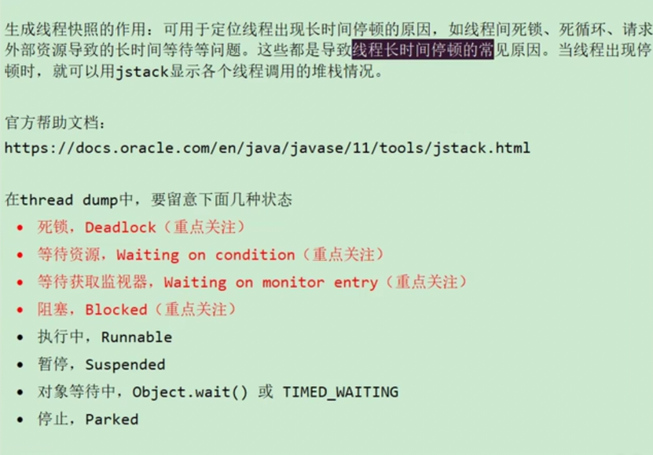

### `jcmd`：多功命令行

### `jstatd`：远程主机信息收集

## 四、JVM GUI监控工具

### VisualVM

### MAT

### JProfile

## 五、内存泄漏的8种情况
- 1.静态集合类
- 2.单例模式
- 3.内部类持有外部类
- 4.各种连接没有释放(如数据库链接、网络连接、IO等)
- 5.变量不合理的作用域问题
- 6.改变Hash值
- 7.缓存泄漏
- 8.监听器和回调
