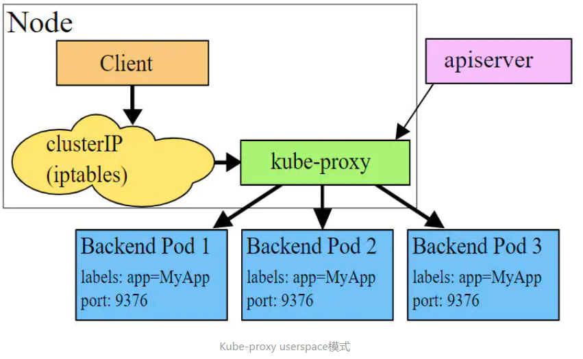

## 7 第七章 Service详解
### 7.1 Service介绍
在kubernetes中，pod是应用程序的载体，我们可以通过pod的ip来访问应用程序，但是pod的ip地址不是固定的，这也就意味着不方便直接采用pod的ip对服务进行访问。

为了解决这个问题，_kubernetes提供了Service资源_，Service会对提供同一个服务的多个pod进行聚合，并且提供一个统一的入口地址。通过访问Service的入口地址就能访问到后面的pod服务。


Service在很多情况下只是一个概念，真正起作用的其实是kube-proxy服务进程，每个Node节点上都运行着一个kube-proxy服务进程。当创建Service的时候会通过api-server向etcd写入创建的service的信息，而kube-proxy会基于监听的机制发现这种Service的变动，然后它会将最新的Service信息转换成对应的访问规则。


kube-proxy目前支持三种工作模式:
- userspace 模式
- iptables 模式
- ipvs 模式

Service的资源清单文件：
```yaml
kind: Service  # 资源类型
apiVersion: v1  # 资源版本
metadata: # 元数据
  name: service # 资源名称
  namespace: dev # 命名空间
spec: # 描述
  selector: # 标签选择器，用于确定当前service代理哪些pod
    app: nginx
  type: # Service类型，指定service的访问方式
  clusterIP:  # 虚拟服务的ip地址
  sessionAffinity: # session亲和性，支持ClientIP、None两个选项
  ports: # 端口信息
    - protocol: TCP 
      port: 3017  # service端口
      targetPort: 5003 # pod端口
      nodePort: 31122 # 主机端口

```
- ClusterIP：默认值，它是Kubernetes系统自动分配的虚拟IP，只能在集群内部访问
- NodePort：将Service通过指定的Node上的端口暴露给外部，通过此方法，就可以在集群外部访问服务
- LoadBalancer：使用外接负载均衡器完成到服务的负载分发，注意此模式需要外部云环境支持
- ExternalName： 把集群外部的服务引入集群内部，直接使用

### 7.2 userspace 模式
userspace模式下，kube-proxy会为每一个Service创建一个监听端口，发向Cluster IP的请求被Iptables规则重定向到kube-proxy监听的端口上，kube-proxy根据LB算法选择一个提供服务的Pod并和其建立链接，以将请求转发到Pod上。   该模式下，kube-proxy充当了一个四层负责均衡器的角色。由于kube-proxy运行在userspace中，在进行转发处理时会增加内核和用户空间之间的数据拷贝，虽然比较稳定，但是效率比较低。



### 7.3 iptables 模式(默认模式)
iptables模式下，kube-proxy为service后端的每个Pod创建对应的iptables规则，直接将发向Cluster IP的请求重定向到一个Pod IP。   该模式下kube-proxy不承担四层负责均衡器的角色，只负责创建iptables规则。该模式的优点是较userspace模式效率更高，但不能提供灵活的LB策略，当后端Pod不可用时也无法进行重试。


### 7.4 ipvs 模式
ipvs模式和iptables类似，kube-proxy监控Pod的变化并创建相应的ipvs规则。ipvs相对iptables转发效率更高。除此以外，ipvs支持更多的LB算法。


此模式，必须要宿主机已经安装了ipvs内核模块，否则Kubernetes会自动降级为iptables模式；如果宿主机已经安装了ipvs内核，则需要在Kubernetes中修改配置开启ipvs规则：
```shell
# 开启ipvs
[root@k8s-master01 ~]# kubectl edit cm kube-proxy -n kube-system
# 修改mode: "ipvs"
```
上面是直接修改ConfigMap对象。

方式二：可以直接修改宿主机主节点上的kube-proxy-config.yaml配置文件：
```yaml
apiVersion: kubeproxy.config.k8s.io/v1alpha1
   kind: KubeProxyConfiguration
   mode: "ipvs"
   ipvs:
     scheduler: "rr" # 设置调度算法，可选值有 "rr"（默认，表示 round-robin），"lc"（表示 least connection），"sh"（表示 source hash）等
     # ...
```
然后使该配置生效：
```shell
kubectl apply -f kube-proxy-config.yaml
```

然后删除系统原有的`kube-proxy` pod对象，删除过后系统会自动根据新配置创建新的`kube-proxy` pod对象
```shell
[root@k8s-master01 ~]# kubectl delete pod -l k8s-app=kube-proxy -n kube-system
```

### 7.5 ClusterIP类型的Service
实验准备：<br>
在使用service之前，首先利用Deployment创建出3个pod，注意要为pod设置app=nginx-pod的标签
```yaml
apiVersion: apps/v1
kind: Deployment      
metadata:
  name: pc-deployment
  namespace: dev
spec: 
  replicas: 3
  selector:
    matchLabels:
      app: nginx-pod
  template:
    metadata:
      labels:
        app: nginx-pod
    spec:
      containers:
      - name: nginx
        image: nginx:1.17.1
        ports:
        - containerPort: 80
```
```shell
[root@k8s-master01 ~]# kubectl create -f deployment.yaml
deployment.apps/pc-deployment created
 
# 查看pod详情
[root@k8s-master01 ~]# kubectl get pods -n dev -o wide --show-labels
NAME                             READY   STATUS     IP            NODE     LABELS
pc-deployment-66cb59b984-8p84h   1/1     Running    10.244.1.39   node1    app=nginx-pod
pc-deployment-66cb59b984-vx8vx   1/1     Running    10.244.2.33   node2    app=nginx-pod
pc-deployment-66cb59b984-wnncx   1/1     Running    10.244.1.40   node1    app=nginx-pod
 
# 为了方便后面的测试，修改下三台nginx的index.html页面（三台修改的IP地址不一致）
# kubectl exec -it pc-deployment-66cb59b984-8p84h -n dev /bin/sh
# echo "10.244.1.39" > /usr/share/nginx/html/index.html
 
#修改完毕之后，访问测试
[root@k8s-master01 ~]# curl 10.244.1.39
10.244.1.39
[root@k8s-master01 ~]# curl 10.244.2.33
10.244.2.33
[root@k8s-master01 ~]# curl 10.244.1.40
10.244.1.40

```

创建service-clusterip.yaml文件：
```yaml
apiVersion: v1
kind: Service
metadata:
  name: service-clusterip
  namespace: dev
spec:
  selector:
    app: nginx-pod
  clusterIP: 10.97.97.97 # service的ip地址，如果不写，默认会生成一个
  type: ClusterIP
  ports:
  - port: 80  # Service端口       
    targetPort: 80 # pod端口

```
```shell
# 创建service
[root@k8s-master01 ~]# kubectl create -f service-clusterip.yaml
service/service-clusterip created
 
# 查看service
[root@k8s-master01 ~]# kubectl get svc -n dev -o wide
NAME                TYPE        CLUSTER-IP    EXTERNAL-IP   PORT(S)   AGE   SELECTOR
service-clusterip   ClusterIP   10.97.97.97   <none>        80/TCP    13s   app=nginx-pod
 
# 查看service的详细信息
# 在这里有一个Endpoints列表，里面就是当前service可以负载到的服务入口
[root@k8s-master01 ~]# kubectl describe svc service-clusterip -n dev
Name:              service-clusterip
Namespace:         dev
Labels:            <none>
Annotations:       <none>
Selector:          app=nginx-pod
Type:              ClusterIP
IP:                10.97.97.97
Port:              <unset>  80/TCP
TargetPort:        80/TCP
Endpoints:         10.244.1.39:80,10.244.1.40:80,10.244.2.33:80
Session Affinity:  None
Events:            <none>
 
# 查看ipvs的映射规则
[root@k8s-master01 ~]# ipvsadm -Ln
TCP  10.97.97.97:80 rr
  -> 10.244.1.39:80               Masq    1      0          0
  -> 10.244.1.40:80               Masq    1      0          0
  -> 10.244.2.33:80               Masq    1      0          0
 
# 访问10.97.97.97:80观察效果
[root@k8s-master01 ~]# curl 10.97.97.97:80
10.244.2.33
```

**Endpoint：**

Endpoint是kubernetes中的一个资源对象，存储在etcd中，用来记录一个service对应的所有pod的访问地址，它是根据service配置文件中selector描述产生的。

一个Service由一组Pod组成，这些Pod通过Endpoints暴露出来，Endpoints是实现实际服务的端点集合。换句话说，service和pod之间的联系是通过endpoints实现的。


**session亲和性：**
```yaml
apiVersion: v1
kind: Service
metadata:
  name: service-clusterip
  namespace: dev
spec:
  selector:
    app: nginx-pod
  clusterIP: 10.97.97.97 # service的ip地址，如果不写，默认会生成一个
  sessionAffinity: ClientIP
  type: ClusterIP
  ports:
  - port: 80  # Service端口       
    targetPort: 80 # pod端口

```
```shell
# 查看ipvs规则【persistent 代表持久】
[root@k8s-master01 ~]# ipvsadm -Ln
TCP  10.97.97.97:80 rr persistent 10800
  -> 10.244.1.39:80               Masq    1      0          0
  -> 10.244.1.40:80               Masq    1      0          0
  -> 10.244.2.33:80               Masq    1      0          0
 
# 循环访问测试
[root@k8s-master01 ~]# while true;do curl 10.97.97.97; sleep 5; done;
10.244.2.33
10.244.2.33
10.244.2.33
  
# 删除service
[root@k8s-master01 ~]# kubectl delete -f service-clusterip.yaml
service "service-clusterip" deleted
```

**HeadLiness类型的Service:**

在某些场景中，开发人员可能不想使用Service提供的负载均衡功能，而希望自己来控制负载均衡策略，针对这种情况，kubernetes提供了HeadLiness Service，这类Service不会分配Cluster IP，如果想要访问service，只能通过service的域名进行查询。

创建service-headliness.yaml
```yaml
apiVersion: v1
kind: Service
metadata:
  name: service-headliness
  namespace: dev
spec:
  selector:
    app: nginx-pod
  clusterIP: None # 将clusterIP设置为None，即可创建headliness Service
  type: ClusterIP
  ports:
  - port: 80    
    targetPort: 80
```
```shell
# 创建service
[root@k8s-master01 ~]# kubectl create -f service-headliness.yaml
service/service-headliness created
 
# 获取service， 发现CLUSTER-IP未分配
[root@k8s-master01 ~]# kubectl get svc service-headliness -n dev -o wide
NAME                 TYPE        CLUSTER-IP   EXTERNAL-IP   PORT(S)   AGE   SELECTOR
service-headliness   ClusterIP   None         <none>        80/TCP    11s   app=nginx-pod
 
# 查看service详情
[root@k8s-master01 ~]# kubectl describe svc service-headliness  -n dev
Name:              service-headliness
Namespace:         dev
Labels:            <none>
Annotations:       <none>
Selector:          app=nginx-pod
Type:              ClusterIP
IP:                None
Port:              <unset>  80/TCP
TargetPort:        80/TCP
Endpoints:         10.244.1.39:80,10.244.1.40:80,10.244.2.33:80
Session Affinity:  None
Events:            <none>
 
# 查看域名的解析情况
[root@k8s-master01 ~]# kubectl exec -it pc-deployment-66cb59b984-8p84h -n dev /bin/sh
/ # cat /etc/resolv.conf
nameserver 10.96.0.10
search dev.svc.cluster.local svc.cluster.local cluster.local
 
[root@k8s-master01 ~]# dig @10.96.0.10 service-headliness.dev.svc.cluster.local
service-headliness.dev.svc.cluster.local. 30 IN A 10.244.1.40
service-headliness.dev.svc.cluster.local. 30 IN A 10.244.1.39
service-headliness.dev.svc.cluster.local. 30 IN A 10.244.2.33
```

### 7.6 NodePort类型的Service
在之前的样例中，创建的Service的ip地址只有集群内部才可以访问，如果希望将Service暴露给集群外部使用，那么就要使用到另外一种类型的Service，称为NodePort类型。NodePort的工作原理其实就是将service的端口映射到Node的一个端口上，然后就可以通过NodeIp:NodePort来访问service了。


```yaml
apiVersion: v1
kind: Service
metadata:
  name: service-nodeport
  namespace: dev
spec:
  selector:
    app: nginx-pod
  type: NodePort # service类型
  ports:
  - port: 80
    nodePort: 30002 # 指定绑定的node的端口(默认的取值范围是：30000-32767), 如果不指定，会默认分配
    targetPort: 80
```

```shell
# 创建service
[root@k8s-master01 ~]# kubectl create -f service-nodeport.yaml
service/service-nodeport created
 
# 查看service
[root@k8s-master01 ~]# kubectl get svc -n dev -o wide
NAME               TYPE       CLUSTER-IP      EXTERNAL-IP   PORT(S)       SELECTOR
service-nodeport   NodePort   10.105.64.191   <none>        80:30002/TCP  app=nginx-pod
 
# 接下来可以通过电脑主机的浏览器去访问集群中任意一个nodeip的30002端口，即可访问到pod
```

### 7.7 LoadBalancer类型的Service
LoadBalancer和NodePort很相似，目的都是向外部暴露一个端口，区别在于LoadBalancer会在集群的外部再来做一个负载均衡设备，而这个设备需要外部环境支持的，外部服务发送到这个设备上的请求，会被设备负载之后转发到集群中。


### 7.8 ExternalName类型的Service
ExternalName类型的Service用于引入集群外部的服务，它通过externalName属性指定外部一个服务的地址，然后在集群内部访问此service就可以访问到外部的服务了。


```yaml
apiVersion: v1
kind: Service
metadata:
  name: service-externalname
  namespace: dev
spec:
  type: ExternalName # service类型
  externalName: www.baidu.com  #改成ip地址也可以
```
```shell
# 创建service
[root@k8s-master01 ~]# kubectl  create -f service-externalname.yaml
service/service-externalname created
 
# 域名解析
[root@k8s-master01 ~]# dig @10.96.0.10 service-externalname.dev.svc.cluster.local
service-externalname.dev.svc.cluster.local. 30 IN CNAME www.baidu.com.
www.baidu.com.          30      IN      CNAME   www.a.shifen.com.
www.a.shifen.com.       30      IN      A       39.156.66.18
www.a.shifen.com.       30      IN      A       39.156.66.14
```

### 7.9 Ingress介绍
在前面课程中已经提到，Service对集群之外暴露服务的主要方式有两种：NotePort和LoadBalancer，但是这两种方式，都有一定的缺点：
- NodePort方式的缺点是会占用很多集群机器的端口，那么当集群服务变多的时候，这个缺点就愈发明显
- LB方式的缺点是每个service需要一个LB，浪费、麻烦，并且需要kubernetes之外设备的支持

基于这种现状，kubernetes提供了Ingress资源对象，Ingress只需要一个NodePort或者一个LB就可以满足暴露多个Service的需求。工作机制大致如下图表示：


实际上，Ingress相当于一个7层的负载均衡器，是kubernetes对反向代理的一个抽象，它的工作原理类似于Nginx，可以理解成在Ingress里建立诸多映射规则，Ingress Controller通过监听这些配置规则并转化成Nginx的反向代理配置 , 然后对外部提供服务。在这里有两个核心概念：
- ingress：kubernetes中的一个对象，作用是定义请求如何转发到service的规则
- ingress controller：具体实现反向代理及负载均衡的程序，对ingress定义的规则进行解析，根据配置的规则来实现请求转发，实现方式有很多，比如Nginx, Contour, Haproxy等等

Ingress（以Nginx为例）的工作原理如下：
- 用户编写Ingress规则，说明哪个域名对应kubernetes集群中的哪个Service
- Ingress控制器动态感知Ingress服务规则的变化，然后生成一段对应的Nginx反向代理配置
- Ingress控制器会将生成的Nginx配置写入到一个运行着的Nginx服务中，并动态更新
- 到此为止，其实真正在工作的就是一个Nginx了，内部配置了用户定义的请求转发规则


搭建ingress环境
```shell

# 创建文件夹
[root@k8s-master01 ~]# mkdir ingress-controller
[root@k8s-master01 ~]# cd ingress-controller/
 
# 获取ingress-nginx，本次案例使用的是0.30版本
[root@k8s-master01 ingress-controller]# wget https://raw.githubusercontent.com/kubernetes/ingress-nginx/nginx-0.30.0/deploy/static/mandatory.yaml
[root@k8s-master01 ingress-controller]# wget https://raw.githubusercontent.com/kubernetes/ingress-nginx/nginx-0.30.0/deploy/static/provider/baremetal/service-nodeport.yaml
 
# 修改mandatory.yaml文件中的仓库
# 修改quay.io/kubernetes-ingress-controller/nginx-ingress-controller:0.30.0
# 为quay-mirror.qiniu.com/kubernetes-ingress-controller/nginx-ingress-controller:0.30.0
# 创建ingress-nginx
[root@k8s-master01 ingress-controller]# kubectl apply -f ./
 
# 查看ingress-nginx
[root@k8s-master01 ingress-controller]# kubectl get pod -n ingress-nginx
NAME                                           READY   STATUS    RESTARTS   AGE
pod/nginx-ingress-controller-fbf967dd5-4qpbp   1/1     Running   0          12h
 
# 查看service
[root@k8s-master01 ingress-controller]# kubectl get svc -n ingress-nginx
NAME            TYPE       CLUSTER-IP     EXTERNAL-IP   PORT(S)                      AGE
ingress-nginx   NodePort   10.98.75.163   <none>        80:32240/TCP,443:31335/TCP   11h

```

准备service和pod

为了后面的实验比较方便，创建如下图所示的模型


```yaml
apiVersion: apps/v1
kind: Deployment
metadata:
  name: nginx-deployment
  namespace: dev
spec:
  replicas: 3
  selector:
    matchLabels:
      app: nginx-pod
  template:
    metadata:
      labels:
        app: nginx-pod
    spec:
      containers:
      - name: nginx
        image: nginx:1.17.1
        ports:
        - containerPort: 80
 
---
 
apiVersion: apps/v1
kind: Deployment
metadata:
  name: tomcat-deployment
  namespace: dev
spec:
  replicas: 3
  selector:
    matchLabels:
      app: tomcat-pod
  template:
    metadata:
      labels:
        app: tomcat-pod
    spec:
      containers:
      - name: tomcat
        image: tomcat:8.5-jre10-slim
        ports:
        - containerPort: 8080
 
---
 
apiVersion: v1
kind: Service
metadata:
  name: nginx-service
  namespace: dev
spec:
  selector:
    app: nginx-pod
  clusterIP: None
  type: ClusterIP
  ports:
  - port: 80
    targetPort: 80
 
---
 
apiVersion: v1
kind: Service
metadata:
  name: tomcat-service
  namespace: dev
spec:
  selector:
    app: tomcat-pod
  clusterIP: None
  type: ClusterIP
  ports:
  - port: 8080
    targetPort: 8080
```

```shell
# 创建
[root@k8s-master01 ~]# kubectl create -f tomcat-nginx.yaml
 
# 查看
[root@k8s-master01 ~]# kubectl get svc -n dev
NAME             TYPE        CLUSTER-IP   EXTERNAL-IP   PORT(S)    AGE
nginx-service    ClusterIP   None         <none>        80/TCP     48s
tomcat-service   ClusterIP   None         <none>        8080/TCP   48s
```

**Http代理:**
```yaml
apiVersion: extensions/v1beta1
kind: Ingress
metadata:
  name: ingress-http
  namespace: dev
spec:
  rules:
  - host: nginx.test.com
    http:
      paths:
      - path: /
        backend:
          serviceName: nginx-service
          servicePort: 80
  - host: tomcat.test.com
    http:
      paths:
      - path: /
        backend:
          serviceName: tomcat-service
          servicePort: 8080
```
```shell
# 创建
[root@k8s-master01 ~]# kubectl create -f ingress-http.yaml
ingress.extensions/ingress-http created
 
# 查看
[root@k8s-master01 ~]# kubectl get ing ingress-http -n dev
NAME           HOSTS                                  ADDRESS   PORTS   AGE
ingress-http   nginx.test.com,tomcat.test.com                   80      22s
 
# 查看详情
[root@k8s-master01 ~]# kubectl describe ing ingress-http  -n dev
...
Rules:
Host                Path  Backends
----                ----  --------
nginx.test.com   / nginx-service:80 (10.244.1.96:80,10.244.1.97:80,10.244.2.112:80)
tomcat.test.com  / tomcat-service:8080(10.244.1.94:8080,10.244.1.95:8080,10.244.2.111:8080)
...
 
# 接下来,在本地电脑上配置host文件,解析上面的两个域名到192.168.109.100(master)上
# 然后,就可以分别访问tomcat.test.com:32240  和  nginx.test.com:32240 查看效果了
```

**Https代理:**

```shell
# 生成证书
openssl req -x509 -sha256 -nodes -days 365 -newkey rsa:2048 -keyout tls.key -out tls.crt -subj "/C=CN/ST=BJ/L=BJ/O=nginx/CN=test.com"

```
```shell
# 创建密钥
kubectl create secret tls tls-secret --key tls.key --cert tls.crt
```
上诉命令解释：<br>
命令格式：
```
kubectl create secret tls NAME --cert=path/to/cert/file --key=path/to/key/file [--dry-run=server|client|none] [options]
```
- `NAME`：要创建的 secret 资源的名称。
- `--cert`：证书文件（PEM编码）的路径。它通常是包含公钥的 X.509 证书。
- `--key`：私钥文件（PEM编码）的路径。
- `--dry-run`：可选参数。执行试运行，不会在集群中真正创建 secret 资源。值可以是 "server"（服务器生成的对象进行验证）、"client"（本地对象进行验证）或 "none"（不进行验证，直接创建资源）。默认值是 "none"。
- `[options]`：其他可选参数，例如 `--namespace`、`-o`（输出格式）等。

```yaml
apiVersion: extensions/v1beta1
kind: Ingress
metadata:
  name: ingress-https
  namespace: dev
spec:
  tls:
    - hosts:
      - nginx.test.com
      - tomcat.test.com
      secretName: tls-secret # 指定秘钥
  rules:
  - host: nginx.test.com
    http:
      paths:
      - path: /
        backend:
          serviceName: nginx-service #指向nginx的service对象
          servicePort: 80
  - host: tomcat.test.com
    http:
      paths:
      - path: /
        backend:
          serviceName: tomcat-service #指向tomact的service对象
          servicePort: 8080
```

```shell
# 创建
[root@k8s-master01 ~]# kubectl create -f ingress-https.yaml
ingress.extensions/ingress-https created
 
# 查看
[root@k8s-master01 ~]# kubectl get ing ingress-https -n dev
NAME            HOSTS                                  ADDRESS         PORTS     AGE
ingress-https   nginx.test.com,tomcat.test.com         10.104.184.38   80, 443   2m42s
 
# 查看详情
[root@k8s-master01 ~]# kubectl describe ing ingress-https -n dev
...
TLS:
  tls-secret terminates nginx.test.com,tomcat.test.com
Rules:
Host              Path Backends
----              ---- --------
nginx.test.com  /  nginx-service:80 (10.244.1.97:80,10.244.1.98:80,10.244.2.119:80)
tomcat.test.com /  tomcat-service:8080(10.244.1.99:8080,10.244.2.117:8080,10.244.2.120:8080)
...
 
# 下面可以通过浏览器访问https://nginx.test.com:31335 和 https://tomcat.test.com:31335来查看了
```


