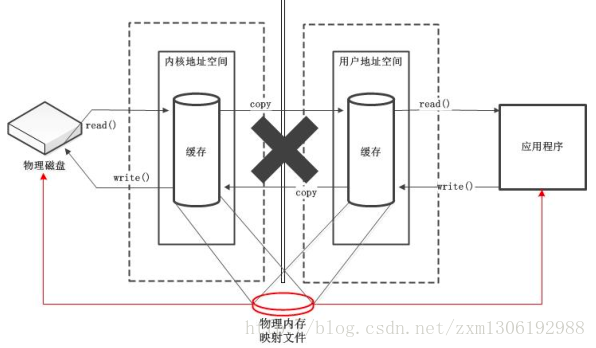
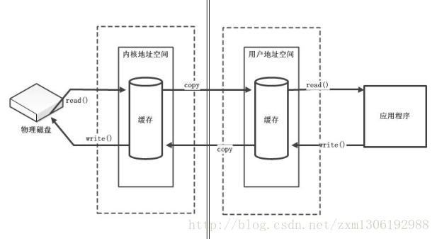

## NIO与IO的区别
Java NIO（New IO或 Non Blocking IO）是从Java 1.4版本开始引入的一个新的IO API，可以替代标准的Java IO API。NIO支持面向缓冲区的、基于通道的IO操作。NIO将以更加高效的方式进行文件的读写操作。<br>

| IO                     | NIO                      |
|------------------------|--------------------------|
| 面向流编程(Stream Oriented) | 面向缓冲区编程(Buffer Oriented) |
| 阻塞IO                   | 非阻塞IO                    |
| 无                      | 选择器(Seletors)            |

## 缓冲区
在Java的NIO中缓冲区是负责数据的存储。其实缓冲区就是一个数组，用于存储不同的类型的数据。根据数据类型的不同，有一下Buffer的常用类：

- ByteBuffer(常用缓冲区)
- CharBuffer
- ShortBuffer
- IntBuffer
- LongBuffer
- FloatBuffer
- DubleBuffer<br>
  上述缓冲区管理方式几乎一样。都是通过allocate()方法获取缓冲区。
``` Java
public void test(){
    //声明一个容量为1024大小的字节非直接缓冲区
    ByteBuffer bf = ByteBuffer.allocate(1024);
}
```

**缓冲区中四个核心属性：**<br>
1. capacity: 容量，表示缓冲区中最大存储数据的容量，一旦声明就不能改变。
2. limit: 界限，表示缓冲区中可以操作数据的大小。(limit之后的数据不能操作)
3. position: 位置，表示缓冲区中正在操作数据的位置。
4. mark: 标记，表示记录当前position位置。可以通过reset()方法将position回复到mark位置。<br>
   <font color="gren">mark <= position <= limit <= capacity</font>

**缓冲区中的常用方法:**<br>
- `put()`方法存放数据到缓冲区
``` Java
public class Test03 {
	public static void main(String[] args) {
		ByteBuffer bf = ByteBuffer.allocate(1024);
		bf.put("hello world".getBytes());
		System.out.println(bf.capacity());//容量为1024
		System.out.println(bf.limit());//界限为1024
		System.out.println(bf.position());//当前位置为11
		System.out.println(new String(bf.array()));// Hello world
	}
}
```
- `flip()`将position归零，limit设置为数据的边界处(一般使用该方法进行读写转换)
``` Java
public class Test03 {
	public static void main(String[] args) {
		ByteBuffer bf = ByteBuffer.allocate(1024);
		bf.put("hello world".getBytes());
		bf.flip(); //切换为读数据模式
		System.out.println(bf.capacity()); //容量为1024
		System.out.println(bf.limit()); //界限为11
		System.out.println(bf.position()); //当前位置为0
		System.out.println(new String(bf.array())); // hello world
	}
}
```
<font color="blue">注意：</font>
``` Java
public class Test03 {
	public static void main(String[] args) {
		ByteBuffer bf = ByteBuffer.allocate(1024);
		bf.put("hello world".getBytes());
		bf.flip();
		System.out.println(bf.capacity());
		System.out.println(bf.limit());
		System.out.println(bf.position());
		System.out.println(new String(bf.array()));
		System.out.println("-------------");
		bf.put("haha".getBytes());
		System.out.println(bf.capacity());
		System.out.println(bf.limit());
		System.out.println(bf.position());
		System.out.println(new String(bf.array()));
	}
}
```
输出结果：
``` Java
1024
11
0
hello world
-------------
1024
11
4
hahao world
```
<font color="blue">从这段代码的运行效果可以看出，在对缓冲区执行了`flip()`方法后，再对缓冲区执行`put()`方法，就相当于修改缓冲区的数据，并且position也会发生跟随修改的数据发生变化。注意：修改的数据不能超过limit的限制，如果超出就会抛出：BufferOverflowException异常。</font><font color="red">该例子充分的证明了，只能操作缓冲区中limit之内的数据，如果操作缓冲区limit之外的数据就会抛出异常。</font>

- `get()`读取缓冲区的数据
``` Java
public class Test03 {
	public static void main(String[] args) {
		ByteBuffer bf = ByteBuffer.allocate(1024);
		bf.put("hello world".getBytes());
		bf.flip();
		byte[] b = new byte[bf.limit()];
		bf.get(b);
		System.out.println(new String(b));//Hello world
		System.out.println(bf.capacity());// 1024
		System.out.println(bf.limit());// 11
		System.out.println(bf.position());// 11
	}
}
```
- `rewind()`将position归零，取消mark的标记,limit不变(一般采用该方式进行可重复读)
``` Java
public class Test03 {
	public static void main(String[] args) {
		ByteBuffer bf = ByteBuffer.allocate(1024);
		bf.put("hello world".getBytes());
		bf.flip();
		byte[] b = new byte[bf.limit()];
		bf.get(b);
		System.out.println(new String(b));
		System.out.println(bf.capacity());
		System.out.println(bf.limit());
		System.out.println(bf.position());
		System.out.println("==========");
		bf.rewind();
		System.out.println(bf.capacity());
		System.out.println(bf.limit());
		System.out.println(bf.position());
	}
}
```
输出结果：
``` Java
hello world
1024
11
11
==========
1024
11
0
```
- `clear()`清空缓冲区。<font color="gren">但是缓冲区中的数据依然存在,只是出于被遗忘状态</font>
``` Java
public class Test03 {
	public static void main(String[] args) {
		ByteBuffer bf = ByteBuffer.allocate(1024);
		bf.put("hello world".getBytes());
		bf.clear();
		System.out.println(bf.capacity());//1024
		System.out.println(bf.limit());//1024
		System.out.println(bf.position());//0
		System.out.println((char)bf.get(1));//e
	}
}
```
<font color="gren">实现这种方式，我们不妨使用`rewind()`方法：</font>
``` Java
public class Test03 {
	public static void main(String[] args) {
		ByteBuffer bf = ByteBuffer.allocate(1024);
		bf.put("hello world".getBytes());
		bf.rewind();
		System.out.println(bf.capacity());//1024
		System.out.println(bf.limit());//1024
		System.out.println(bf.position());//0
		System.out.println((char)bf.get(1));//e
	}
}
```
- `mark()`标记此时position的位置，`reset()`恢复到mark的位置
``` Java
public class Test03 {
	public static void main(String[] args) {
		ByteBuffer bf = ByteBuffer.allocate(1024);
		bf.put("hello world".getBytes());
		bf.flip();
		byte[] b = new byte[bf.limit()];
		bf.get(b,0,2);
		System.out.println(bf.position());//2
		System.out.println(new String(b));//he
		bf.mark();
		bf.get(b, 2, 2);
		System.out.println(bf.position());//4
		System.out.println(new String(b));//hell
		bf.reset();
		System.out.println(bf.position());//2
	}
}
```
- `hasRemaining()`判断缓冲区中是否还有剩余的数据，`remaining()`获取缓冲区剩余数据的数量
``` Java
public class Test03 {
	public static void main(String[] args) {
		ByteBuffer bf = ByteBuffer.allocate(1024);
		bf.put("hello world".getBytes());
		bf.flip();
		byte[] b = new byte[bf.limit()];
		bf.get(b,0,10);
		if(bf.hasRemaining()) {
			System.out.println(bf.remaining());
		}
		
	}
}
//输出结果为：1
```
<font color="red">`get(int index)`、`put(int index, byte b)`等都不会改变position的值</font>

**直接缓冲区和非直接缓冲区：**<br>
直接缓冲区：直接在物理内存中创建的缓冲区叫做直接缓冲区。<br>


非直接缓冲区：创建的缓存是冲JVM内存中开辟的空间叫做非直接缓冲区。<br>

直接缓冲区一旦创建成功，我们只能控制向缓冲区中读写数据，但是却不能控制缓冲区的数据多久或者何时被操作系统写入到磁盘中。非直接缓冲区的数据写入到磁盘中需要物理内存copy一份JVM虚拟机总的缓存区中的数据，再进行写入磁盘，这种方式相对直接缓冲区再性能和效率上肯定会低很多。
``` Java
public void test(){
    //创建非直接缓冲区
    ByteBuffer.allocate();
    //创建直接缓冲区
    ByteBuffer.allocateDir();
}
```

## 通道
用于源节点与目标节点的连接。在java NIO中负责缓冲区中数据的传输。Channel本身不存储数据，需要配合缓冲区进行传输。通道由java.nio.channels包定义。

**通道的主要实现类：**<br>
- java.nio.channels.Channel 接口：
    - FileChannel：用于读取、写入、映射和操作文件的通道。
    - SocketChannel：通过 TCP 读写网络中的数据。
    - ServerSocketChannel：可以监听新进来的 TCP 连接，对每一个新进来的连接都会创建一个 SocketChannel。
    - DatagramChannel：通过 UDP 读写网络中的数据通道。

**获取通道主要方式**：<br>
- 1.java针对支持通道的类提供了getChannel()方法<br>
  本地IO：FileInputStream/FileOutputStream、RandomAccessFile<br>
  网络IO：Socket、ServerSocket、DatagramSocket
- 2.在JDK 1.7 中的NIO.2 针对各个通道提供了静态方法 open()
- 3.在JDK 1.7 中的NIO.2 的Files工具类的newByteChannel()

例子：使用NIO实现本地磁盘文件的拷贝；
- 方式1:采用非直接缓冲区
``` Java
    @Test
	public void test1() throws IOException {
		//获取文件的输入输出流
		FileInputStream in = new FileInputStream("E:/1.pdf");
		FileOutputStream out = new FileOutputStream("E:/2.pdf");
		//获取输入输出管道
		FileChannel outChannel = out.getChannel();
		FileChannel inChannel = in.getChannel();
		//创建一个缓存区
		ByteBuffer bf = ByteBuffer.allocate(1024);
		while((inChannel.read(bf)) != -1) {
			//将缓冲区切换为读取数据模式
			bf.flip();
			outChannel.write(bf);
			//清空缓冲区
			bf.clear();
		}
		//关闭管道和流
		outChannel.close();
		inChannel.close();
		out.close();
		in.close();
	}
```
- 方式2:采用直接缓冲区
``` Java
    @Test
	public void test2() throws IOException {
		// 获取输入输出管道
		FileChannel outChannel = FileChannel.open(Paths.get("E:/2.pdf"), StandardOpenOption.WRITE,
				StandardOpenOption.READ, StandardOpenOption.CREATE);
		FileChannel inChannel = FileChannel.open(Paths.get("E:/1.pdf"), StandardOpenOption.READ);
		//內存映射
		MappedByteBuffer inMapBuffer = inChannel.map(MapMode.READ_ONLY, 0, inChannel.size());
		MappedByteBuffer outMapBuffer = outChannel.map(MapMode.READ_WRITE, 0, inChannel.size());
		byte[] dst = new byte[inMapBuffer.limit()];
		inMapBuffer.get(dst); //读取数据到数组中
		outMapBuffer.put(dst);
	}
```
- 方式3:采用`transferTo`或者`transferFrom`方法(该方式也是采用的直接缓冲区)
``` Java
    @Test
	public void test3() throws IOException {
		//获取输入输出管道
		FileChannel inChannel = FileChannel.open(Paths.get("E:/1.pdf"), StandardOpenOption.READ);
		FileChannel outChannel = FileChannel.open(Paths.get("2.pdf"), StandardOpenOption.WRITE,StandardOpenOption.READ,StandardOpenOption.CREATE);
		//输入管道传输到输出管道
		//inChannel.transferTo(0, inChannel.size(), outChannel);
		outChannel.transferFrom(inChannel, 0, inChannel.size());
	}
```
## NIO的非阻塞式网络编程
传统的 IO 流都是阻塞式的。也就是说，当一个线程调用 read() 或 write()时，该线程被阻塞，直到有一些数据被读取或写入，该线程在此期间不能执行其他任务。因此，在完成网络通信进行 IO 操作时，由于线程会阻塞，所以服务器端必须为每个客户端都提供一个独立的线程进行处理，当服务器端需要处理大量客户端时，性能急剧下降。

Java NIO 是非阻塞模式的。当线程从某通道进行读写数据时，若没有数据可用时，该线程可以进行其他任务。线程通常将非阻塞 IO 的空闲时间用于在其他通道上执行 IO 操作，所以单独的线程可以管理多个输入和输出通道。因此，NIO 可以让服务器端使用一个或有限几个线程来同时处理连接到服务器端的所有客户端。

这种方式就为阻塞式的NIO
``` Java
public class Test05 {
	@Test
	public void client() throws IOException {
		// 打开客户端链接服务端的通道
		SocketChannel socketChannel = SocketChannel.open(new InetSocketAddress("127.0.0.1", 8888));
		//指定大小的缓冲区
		ByteBuffer byteBuffer = ByteBuffer.allocate(1024);
		byteBuffer.put("hello world".getBytes(Charset.forName("UTF-8")));
		//发送数据
		byteBuffer.flip();
		socketChannel.write(byteBuffer);
		byteBuffer.clear();
		socketChannel.shutdownOutput();//关闭发送通道，表明发送数据完毕
		
		//接受服务端的反馈
		int len = 0;
		while((len = socketChannel.read(byteBuffer)) != -1) {
			byteBuffer.flip();
			System.out.println(new String(byteBuffer.array(),0,len));
			byteBuffer.clear();
		}
		//关闭管道
		socketChannel.close();
	}
	
	@Test
	public void server() throws IOException {
		ServerSocketChannel  ssChannel = ServerSocketChannel.open();
		ssChannel.bind(new InetSocketAddress(8888));
		SocketChannel socketChannel = ssChannel.accept();
		ByteBuffer bf = ByteBuffer.allocate(1024);
		int len = 0;
		while((len= socketChannel.read(bf)) != -1) {
			bf.flip();
			System.out.println(new String(bf.array(),0,len));
			bf.clear();
		}
		//发送反馈信息给客户端
		bf.put("me too".getBytes(Charset.forName("UTF-8")));
		bf.flip();
		System.out.println(new String(bf.array(),0,bf.limit()));
		socketChannel.write(bf);
		ssChannel.close();
		socketChannel.close();
	}
}
```
## 选择器`Selector`
`Selector`选择器是`SelectableChannel`对象的多路复用器。`Selector` 可以同时监控多个 `SelectableChannel`的IO状况，也就是说，利用 `Selector`可使一个单独的线程管理多个 `Channel`。`Selector` 是非阻塞 IO 的核心。

`Selector`的常用方法：

| 方法                       | 描述                                                                                            |
|--------------------------|-----------------------------------------------------------------------------------------------|
| Set<SelectionKey> keys() | 所有的SelectionKey集合，代表注册在Selector上所有的Channel                                                    |
| selectedKey()            | 被选中的SelectionKey的集合，返回Selector已经选中的键表                                                         |
| int select()             | 监控所有注册的Channel，当他们中间有需要处理IO操作时，该方法返回，并将对应得的SelectionKey加入被选中的SelectionKey集合中，该方法返回Channel的数量。 |
| int selectNow()          | 执行一个立即返回的select()方法，该方法不会阻塞线程                                                                 |
| Selector wakeup()        | 使得一个还未返回的select()方法立即返回                                                                       |
| void close()             | 关闭选择器                                                                                         |

## `SelectionKey`
当调用 register(Selector sel, int ops) 将通道注册选择器时，选择器对通道的监听事件，需要通过第二个参数 ops 指定。

| 监听的事件的类型 | 常量                      | 常量值 |
|----------|-------------------------|-----|
| 读        | SelectionKey.OP_READ    | 1   |
| 写        | SelectionKey.OP_WRITE   | 4   |
| 连接       | SelectionKey.OP_CONNECT | 8   |
| 接收       | SelectionKey.OP_ACCEPT  | 16  |

如果注册的时候，不至监听一个事件，可以使用'|'运算符进行多个事件的连接。

`SelectionKey`的常用方法

| 方法                          | 描述                   |
|-----------------------------|----------------------|
| int interestOps()           | 获取感兴趣的事件集合           |
| int readyOps()              | 获取通道已经准备就绪的操作集合      |
| SelectableChannel channel() | 获取注册通道               |
| Selector selector()         | 返回选择器                |
| boolean isReadable()        | 检查Channel中读事件是否准备就绪  |
| boolean isWritable()        | 检查Channel中写事件是否准备就绪  |
| boolean isConnectable()     | 检查Channel中连接事件是否准备就绪 |
| boolean isAcceptable()      | 检查Channel中接收事件是否准备就绪 |

NIO实现非阻塞式的网络编程：
``` Java
public class Test06 {
	
	@Test
	public void client() throws IOException {
		//创建绑定服务端的管道
		SocketChannel sChannel = SocketChannel.open(new InetSocketAddress("127.0.0.1", 9999));
		//切换为非阻塞式模式
		sChannel.configureBlocking(false);
		//分配指定大小的缓冲区
		ByteBuffer bf = ByteBuffer.allocate(1024);
		//发送数据给服务端
		Scanner sc = new Scanner(System.in);
		while(sc.hasNext()) {
			bf.put(sc.next().getBytes(Charset.forName("UTF-8")));
			bf.flip();
			sChannel.write(bf);
			bf.clear();
		}
		//关不管道
		sChannel.close();
	}
	
	@Test
	public void server() throws IOException {
		//创建服务端管道，并绑定需要监控的端口
		ServerSocketChannel ssChannel = ServerSocketChannel.open();
		ssChannel.bind(new InetSocketAddress(9999));
		ssChannel.configureBlocking(false);
		//获取选择器
		Selector selector = Selector.open();
		//将通道注册到选择器中
		ssChannel.register(selector, SelectionKey.OP_ACCEPT);
		//轮训式获取数据
		//select()方法是阻塞的，一旦获取到有数据就开始执行下一步
		while(selector.select()>0) {
			//获取当前选择其中已经被选中的键表
			Iterator<SelectionKey> it = selector.selectedKeys().iterator();
			
			while(it.hasNext()) {
				SelectionKey key = it.next();
				//判断事件的类型
				if(key.isAcceptable()) {
					// 若接收就绪，就创建客户端连接的通道
					SocketChannel sChannel = ssChannel.accept();
					// 切换通道为非阻塞式
					sChannel.configureBlocking(false);
					//将通道注册到选择器中
					sChannel.register(selector, SelectionKey.OP_READ);
				}else if(key.isReadable()) {
					//获取当前选择器中"读就绪"的通道
					SocketChannel channel = (SocketChannel) key.channel();
					//读取数据
					ByteBuffer bf = ByteBuffer.allocate(1024);
					int len = 0;
					while((len=channel.read(bf)) > 0) {
						bf.flip();
						System.out.println(new String(bf.array(),0,len,"UTF-8"));
						bf.clear();
					}
				}
				//移除选择键
				it.remove();
			}
			
		}
	}
}
```

关于UDP、管道等方式，请参考引用部分。
>引用：https://blog.csdn.net/zxm1306192988/article/details/60581173


