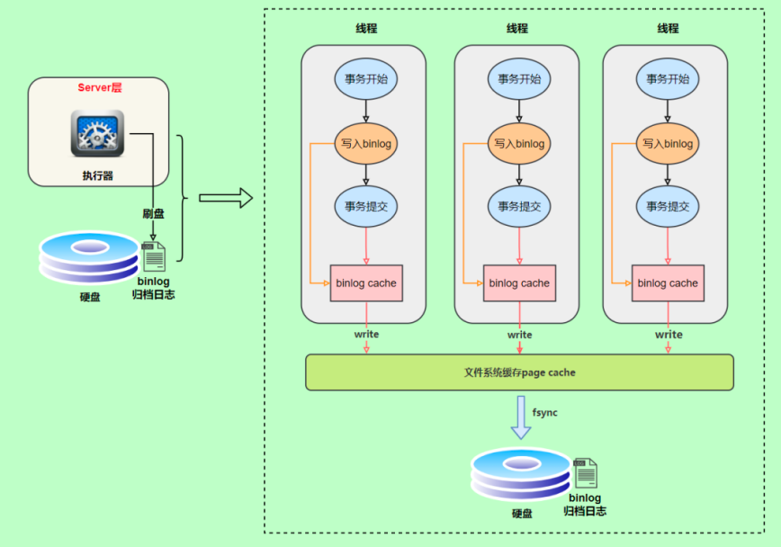
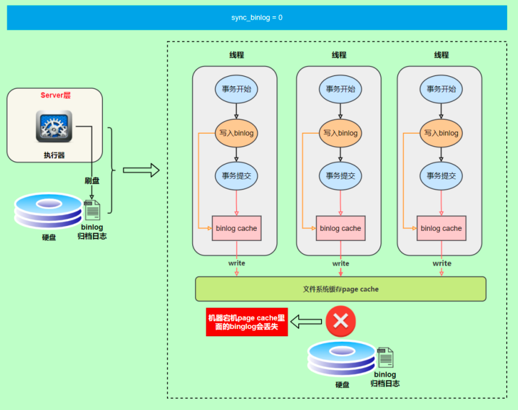
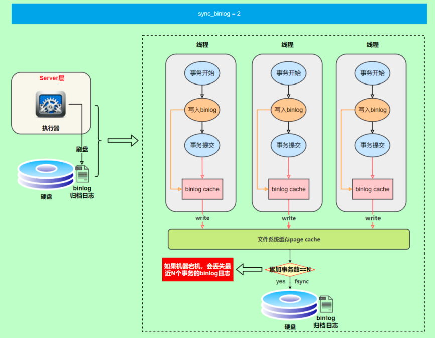
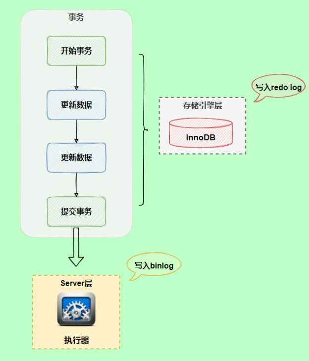
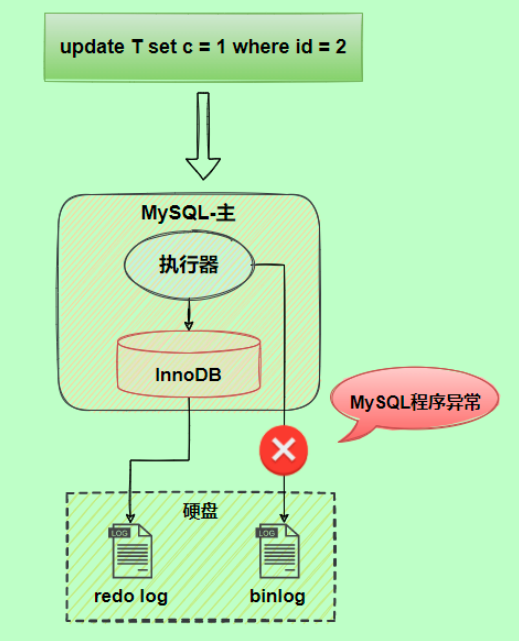
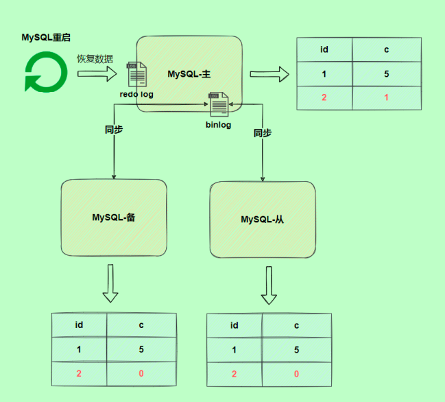
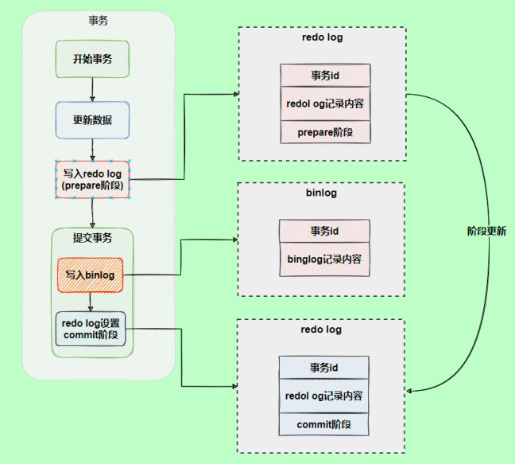
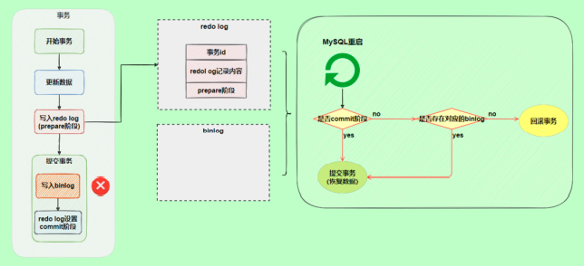
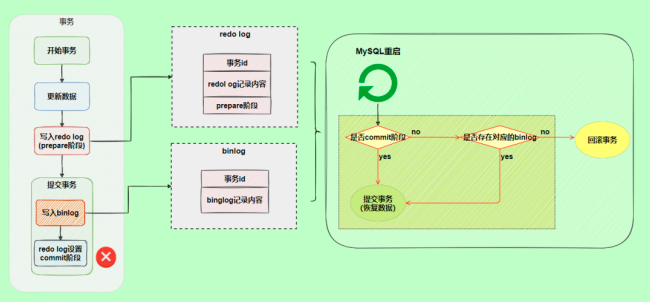

# MySQL 日志
## 一、错误日志
错误日志是 MySQL 中最重要的日志之一，它记录了当 mysqld 启动和停止时，以及服务器在运行过程中发生任何严重错误时的相关信息。当数据库出现任何故障导致无法正常使用时，建议首先查看此日志。

该日志是默认开启的，默认存放目录 /var/log/，默认的日志文件名为 mysqld.log 。查看日志位置：

```sql
show variables like '%log_error%';
```
```sql
mysql> show variables like '%log_error%';
+----------------------------+----------------------------------------+
| Variable_name              | Value                                  |
+----------------------------+----------------------------------------+
| binlog_error_action        | ABORT_SERVER                           |
| log_error                  | /var/log/mysqld.log                    |
| log_error_services         | log_filter_internal; log_sink_internal |
| log_error_suppression_list |                                        |
| log_error_verbosity        | 2                                      |
+----------------------------+----------------------------------------+
5 rows in set (0.13 sec)
```

## 二、查询日志

查询日志中记录了客户端的所有操作语句，而二进制日志不包含查询数据的SQL语句。默认情况下，查询日志是未开启的。

```sql
mysql> show variables like '%general%';
+------------------+---------------------------------+
| Variable_name    | Value                           |
+------------------+---------------------------------+
| general_log      | OFF                             |
| general_log_file | /var/lib/mysql/2e6ee607e519.log |
+------------------+---------------------------------+
2 rows in set (0.01 sec)


```
如果需要开启查询日志，可以修改MySQL的配置文件 /etc/my.cnf 文件，添加如下内容：

```
#该选项用来开启查询日志 ， 可选值 ： 0 或者 1 ； 0 代表关闭， 1 代表开启

general_log=1

#设置日志的文件名 ， 如果没有指定， 默认的文件名为 host_name.log

general_log_file=mysql_query.log

```
开启了查询日志之后，在MySQL的数据存放目录，也就是 /var/lib/mysql/ 目录下就会出现mysql_query.log 文件。之后所有的客户端的增删改查操作都会记录在该日志文件之中，长时间运行后，该日志文件将会非常大。

## 三、慢查询日志

慢查询日志记录了所有执行时间超过参数 long_query_time 设置值并且扫描记录数不小于 min_examined_row_limit 的所有的SQL语句的日志，默认未开启。long_query_time 默认为10 秒，最小为 0， 精度可以到微秒。

如果需要开启慢查询日志，需要在MySQL的配置文件 /etc/my.cnf 中配置如下参数：
```
#慢查询日志 1 代表开启 0 代表关闭
#开启慢查询日志，如果出现超过执行时间的sql将被记录在/var/lib/mysql/localhost-slow.log文件中

slow_query_log=1

#执行时间参数 单位是s

long_query_time=2

```
默认情况下，不会记录管理语句，也不会记录不使用索引进行查找的查询。可以使用 log_slow_admin_statements和 更改此行为 log_queries_not_using_indexes，如下所述。

```
#记录执行较慢的管理语句

log_slow_admin_statements =1

#记录执行较慢的未使用索引的语句

log_queries_not_using_indexes = 1

```
> 上述所有的参数配置完成之后，都需要重新启动MySQL服务器才可以生效。


## 四、二进制日志(binlog)
### 4.1 介绍

二进制日志（BINLOG）记录了所有的 DDL（数据定义语言）语句和 DML（数据操纵语言）语句，但不包括数据查询（SELECT、SHOW）语句。

作用：<br>
①. 灾难时的数据恢复；<br>
②. MySQL的主从复制。<br>
在MySQL8版本中，默认二进制日志是开启着的，涉及到的参数如下：
```sql
mysql> show variables like '%log_bin%';
+---------------------------------+-----------------------------+
| Variable_name                   | Value                       |
+---------------------------------+-----------------------------+
| log_bin                         | ON                          |
| log_bin_basename                | /var/lib/mysql/binlog       |
| log_bin_index                   | /var/lib/mysql/binlog.index |
| log_bin_trust_function_creators | OFF                         |
| log_bin_use_v1_row_events       | OFF                         |
| sql_log_bin                     | ON                          |
+---------------------------------+-----------------------------+
6 rows in set (0.03 sec)
```
```sql
mysql> show variables like '%max_binlog_size%';
+-----------------+------------+
| Variable_name   | Value      |
+-----------------+------------+
| max_binlog_size | 1073741824 |
+-----------------+------------+
1 row in set (0.06 sec)
```
```shell
bash-4.4# ls -la /var/lib/mysql | grep binlog
-rw-r----- 1 mysql mysql      179 May 16 08:57 binlog.000008
-rw-r----- 1 mysql mysql      156 May 16 09:39 binlog.000009
-rw-r----- 1 mysql mysql       32 May 16 09:39 binlog.index
```

参数说明：

- `log_bin_basename`：当前数据库服务器的binlog日志的基础名称(前缀)，具体的binlog文件名需要在该basename的基础上加上编号(编号从000001开始)。
- `log_bin_index`：binlog的索引文件，里面记录了当前服务器关联的binlog文件有哪些。  
  在sql命令界面, 我们也可以通过`show binary logs;`查看当前的二进制日志文件列表及大小
    ```
    mysql> show binary logs;
    +---------------+-----------+
    | Log_name      | File_size |
    +---------------+-----------+
    | binlog.000001 |       313 |
    +---------------+-----------+
    1 row in set (0.00 sec)
    ```
- `max_binlog_size`: 控制单个二进制文件大小，默认为1G；如果日志文件大小大于该变量值，会进行切换操作，但是也不一定严格按照这个要求进行。如果临近边界值，执行一个比较大的操作，在一个事务当中，会把该事务的数据都记录在该日志文件中，过后再进行切换。一般不修改该值，建议就用默认值；

以上说的一些参数都是mysql的默认值，我们也可以通过修改配置文件的方式，永久的修改该值：  
修改MySQL的 my.cnf 或 my.ini 文件可以设置二进制日志的相关参数
```
#启用二进制日志
log-bin=binlog
binlog_expire_logs_seconds=600
max_binlog_size=100M
```

> <font color="red">每次重启MySQL服务，会生成一个新的二进制日志文件</font>

### 4.2 格式

MySQL服务器中提供了多种格式来记录二进制日志，具体格式及特点如下：

- `STATEMENT`	基于SQL语句的日志记录，记录的是SQL语句，对数据进行修改的SQL都会记录在日志文件中。
- `ROW`	基于行的日志记录，记录的是每一行的数据变更。（默认）
- `MIXED`	混合了STATEMENT和ROW两种格式，默认采用STATEMENT，在某些特殊情况下会自动切换为ROW进行记录。

```sql
mysql> show variables like '%binlog_format';
+---------------+-------+
| Variable_name | Value |
+---------------+-------+
| binlog_format | ROW   |
+---------------+-------+
1 row in set (0.01 sec)
```
**<font color="red">如果我们需要配置二进制日志的格式，只需要在 /etc/my.cnf 中配置 binlog_format 参数即可。</font>**

### 4.3 查看

由于日志是以二进制方式存储的，不能直接读取，需要通过二进制日志查询工具 mysqlbinlog 来查看，具体语法：

```
mysqlbinlog [ 参数选项 ] logfilename

参数选项：
	-d 指定数据库名称，只列出指定的数据库相关操作。
	-o 忽略掉日志中的前n行命令。
	-v 将行事件(数据变更)重构为SQL语句
	-vv 将行事件(数据变更)重构为SQL语句，并输出注释信息

```
以上命令是在命令行窗口使用；  
如果在sql命令行窗口，可以通过以下语句查看二进制日志文件内容：
```sql
show binlog events [IN 'log_name'] [FROM pos] [LIMIT [offset,] row_count];
- IN 'log_name' ：指定要查询的binlog文件名（不指定就是第一个binlog文件）
- FROM pos ：指定从哪个pos起始点开始查起（不指定就是从整个文件首个pos点开始算）
- LIMIT [offset] ：偏移量(不指定就是0)
- row_count :查询总条数（不指定就是所有行）
```

### 4.4 删除

对于比较繁忙的业务系统，每天生成的binlog数据巨大，如果长时间不清除，将会占用大量磁盘空间。可以通过以下几种方式清理日志：

- `reset master	`: 删除全部 binlog 日志，删除之后，日志编号，将从 binlog.000001重新开始
- `purge master logs to 'binlog.*'	`: 删除 * 编号之前的所有日志
- `purge master logs before 'yyyy-mm-dd hh24:mi:ss'	` : 删除日志为 "yyyy-mm-dd hh24:mi:ss" 之前产生的所有日志

也可以在mysql的配置文件中配置二进制日志的过期时间，设置了之后，二进制日志过期会自动删除。

```sql
mysql> show variables like '%binlog_expire_logs_seconds%';
+----------------------------+---------+
| Variable_name              | Value   |
+----------------------------+---------+
| binlog_expire_logs_seconds | 2592000 |
+----------------------------+---------+
1 row in set (0.02 sec)
```

### 4.5 根据binlog日志恢复数据

MySQL的二进制日志（binlog）记录了数据库中所有更改的操作。当数据丢失或发生问题时，可以使用binlog日志来恢复数据。

步骤如下：

1. 切换到MySQL的日志目录：

```bash
cd /var/lib/mysql
```

这里的路径可能因不同的系统和配置而有所不同。请根据您的系统找到正确的binlog文件目录。

2. 确保数据库服务器运行时具有二进制日志记录的功能。请检查`my.cnf`（`/etc/mysql/my.cnf` 或 `/etc/my.cnf`）文件是否包含以下设置：

```ini
log_bin = /var/lib/mysql/binlog.log
```

如果尚未启用，请启用它并重新启动MySQL数据库服务器。

3. 识别开始恢复数据所需的binlog文件和开始恢复数据的时间点。可以使用以下命令查看binlog文件列表，并根据时间序列找到相关文件：

```bash
ls -l /var/lib/mysql/binlog.*
```

4. 查看binlog日志内容，找到所需的交易开始（`START TIME`）和结束时间（`END TIME`）。可以使用以下命令：

```bash
mysqlbinlog binlog.000001
```

将`binlog.000001`替换为您要查看的实际日志文件。

5. 使用`mysqlbinlog`工具将开始恢复数据（`START TIME`）和结束时间（`END TIME`）之间的操作导出到SQL文件中：

```bash
mysqlbinlog --start-datetime="2022-05-18 10:00:00" --stop-datetime="2022-05-18 13:00:00" binlog.000001 > recovered_data.sql
```

根据需要替换开始时间、结束时间和binlog文件名。

6. 使用从binlog导出的SQL文件向MySQL数据库导入数据：

```bash
mysql -u username -p database_name < recovered_data.sql
```

替换`username`、`database_name`为实际用户名和数据库名称。在提示时输入密码。

现在，您已成功使用binlog日志恢复MySQL 数据库中的数据。需要注意的是，这种方法仅适用于因误操作、软件错误等原因导致的数据丢失。在硬件故障等场景下，还需要备份和其他恢复策略。

> <font color="red">注意：如果要恢复到某个时间点的数据，需要结合数据库备份文件和binlog日志文件进行操作，将最近备份文件sql+binlog提取备份文件时间点到恢复的时间点的sql一起执行，就能达到恢复到某个时间点的效果。</font>

## 五、再谈二进制日志(binlog)
### 5.1 写入机制
`binlog`的写入时机也非常简单，事务执行过程中，先把日志写到 `binlog cache` ，事务提交的时候，再把`binlog cache`写到`binlog`文件中。因为一个事务的`binlog`不能被拆开，无论这个事务多大，也要确保一次性写入，所以系统会给每个线程分配一个块内存作为`binlog cache`。

我们可以通过`binlog_cache_size`参数控制单个线程 `binlog cache` 大小，如果存储内容超过了这个参数，就要暂存到磁盘（Swap）。binlog日志刷盘流程如下：


上图的write，是指把日志写入到文件系统的page cache，并没有把数据持久化到磁盘，所以速度比较快  
上图的fsync，才是将数据持久化到磁盘的操作

write和fsync的时机，可以由参数 `sync_binlog` 控制，默认是 0 。为0的时候，表示每次提交事务都只 write，由系统自行判断什么时候执行fsync。虽然性能得到提升，但是机器宕机，page cache里面的 binglog 会丢失。如下图：



为了安全起见，可以设置为 1 ，表示每次提交事务都会执行fsync，就如同redo log 刷盘流程一样。 最后还有一种折中方式，可以设置为N(N>1)，表示每次提交事务都write，但累积N个事务后才fsync。



在出现IO瓶颈的场景里，将sync_binlog设置成一个比较大的值，可以提升性能。同样的，如果机器宕机，会丢失最近N个事务的binlog日志。

### 5.2 binlog与redolog对比
- redo log 它是 物理日志 ，记录内容是“在某个数据页上做了什么修改”，属于 InnoDB 存储引擎层产生的
- 而 binlog 是 逻辑日志 ，记录内容是语句的原始逻辑，类似于“给 ID=2 这一行的 c 字段加 1”，属于 MySQL Server 层

虽然它们都属于持久化的保证，但是侧重点不同：
- redo log让InnoDB存储引擎拥有了崩溃恢复能力
- binlog保证了MySQL集群架构的数据一致性

### 5.3 两阶段提交
在执行更新语句过程，会记录redo log与binlog两块日志，以基本的事务为单位，redo log在事务执行过程中可以不断写入，而binlog只有在提交事务时才写入，所以redo log与binlog的 写入时机 不一样。



redo log与binlog两份日志之间的逻辑不一致，会出现什么问题？  
以update语句为例，假设id=2的记录，字段c值是0，把字段c值更新为1，SQL语句为update T set c = 1 where id = 2。  
假设执行过程中写完redo log日志后，binlog日志写期间发生了异常，会出现什么情况呢？



由于binlog没写完就异常，这时候binlog里面没有对应的修改记录。因此，之后用binlog日志恢复数据时，就会少这一次更新，恢复出来的这一行c值为0，而原库因为redo log日志恢复，这一行c的值是1，最终数据不一致。



为了解决两份日志之间的逻辑一致问题，InnoDB存储引擎使用两阶段提交方案。原理很简单，将redo log的写入拆成了两个步骤prepare和commit，这就是两阶段提交。



使用两阶段提交后，写入binlog时发生异常也不会有影响，因为MySQL根据redo log日志恢复数据时，发现redo log还处于prepare阶段，并且没有对应binlog日志，就会回滚该事务。



另一个场景，redo log设置commit阶段发生异常，那会不会回滚事务呢？



并不会回滚事务，它会执行上图框住的逻辑，虽然redo log是处于prepare阶段，但是能通过事务id找到对应的binlog日志，所以MySQL认为是完整的，就会提交事务恢复数据。

## 六、中继日志(relay log)
### 6.1 介绍
中继日志只在主从服务器架构的从服务器上存在。从服务器为了与主服务器保持一致，要从主服务器读取二进制日志的内容，并且把读取到的信息写入 本地的日志文件 中，这个从服务器本地的日志文件就叫 **中继日志** 。然后，从服务器读取中继日志，并根据中继日志的内容对从服务器的数据进行更新，完成主 从服务器的 数据同步 。

搭建好主从服务器之后，中继日志默认会保存在从服务器的数据目录下。

文件名的格式是： `从服务器名-relay-bin.序号` 。中继日志还有一个索引文件：`从服务器名-relaybin.index` ，用来定位当前正在使用的中继日志。

### 6.2 查看中继日志
中继日志与二进制日志的格式相同，可以用 `mysqlbinlog` 工具进行查看。下面是中继日志的一个片段：
```
SET TIMESTAMP=1618558728/*!*/;
BEGIN
/*!*/;
# at 950
#210416 15:38:48 server id 1 end_log_pos 832 CRC32 0xcc16d651 Table_map:
`atguigu`.`test` mapped to number 91
# at 1000
#210416 15:38:48 server id 1 end_log_pos 872 CRC32 0x07e4047c Delete_rows: table id
91 flags: STMT_END_F -- server id 1 是主服务器，意思是主服务器删了一行数据
BINLOG '
CD95YBMBAAAAMgAAAEADAAAAAFsAAAAAAAEABGRlbW8ABHRlc3QAAQMAAQEBAFHWFsw=
CD95YCABAAAAKAAAAGgDAAAAAFsAAAAAAAEAAgAB/wABAAAAfATkBw==
'/*!*/;
# at 1040

```
### 6.3 恢复的典型错误
如果从服务器宕机，有的时候为了系统恢复，要重装操作系统，这样就可能会导致你的 服务器名称 与之前 不同 。而中继日志里是 包含从服务器名 的。在这种情况下，就可能导致你恢复从服务器的时候，无法 从宕机前的中继日志里读取数据，以为是日志文件损坏了，其实是名称不对了。

解决的方法也很简单，把从服务器的名称改回之前的名称。


