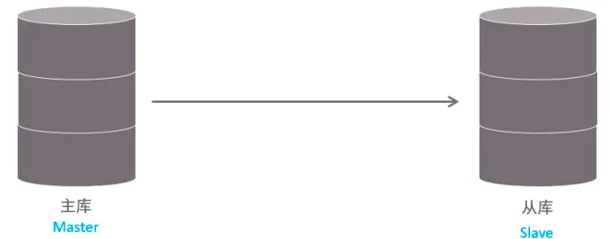

# MySQL 主从复制
## 一、概述
主从复制是指将主数据库的 DDL 和 DML 操作通过二进制日志传到从库服务器中，然后在从库上对这些日志重新执行（也叫重做），从而使得从库和主库的数据保持同步。

MySQL支持一台主库同时向多台从库进行复制， 从库同时也可以作为其他从服务器的主库，实现链状复制。



MySQL 复制的优点主要包含以下三个方面：

- 主库出现问题，可以快速切换到从库提供服务。
- 实现读写分离，降低主库的访问压力。
- 可以在从库中执行备份，以避免备份期间影响主库服务。

## 二、原理
MySQL主从复制的核心就是 二进制日志，具体的过程如下：


从上图来看，复制分成三步：

- 1.Master 主库在事务提交时，会把数据变更记录在二进制日志文件 Binlog 中。
- 2.从库读取主库的二进制日志文件 Binlog ，写入到从库的中继日志 Relay Log 。
- 3.slave重做中继日志中的事件，将改变反映它自己的数据。

## 三、搭建
### 3. 1.准备


准备好两台服务器之后，在上述的两台服务器中分别安装好MySQL，并完成基础的初始化准备(安装、密码配置等操作)工作。 其中：

- 192.168.91.166 作为主服务器master
- 192.168.91.167 作为从服务器slave

### 3.2.主库配置
- 3.2.1.修改配置文件 /etc/my.cnf
```bash
#[必须]mysql 服务ID，保证整个集群环境中唯一，取值范围：1 – 232-1，默认为1
server-id=1

#[必须]启用二进制日志,指名路径。比如：自己本地的路径/log/mysqlbin
log-bin=binlog

#[可选]是否只读,1 代表只读, 0 代表读写 默认为0
read-only=0

#[可选]设置日志文件保留的时长，单位是秒 默认是2592000s
#binlog_expire_logs_seconds=6000

#[可选]控制单个二进制日志大小。此参数的最大和默认值是1GB
#max_binlog_size=200M

#[可选]忽略的数据, 指不需要同步的数据库
#binlog-ignore-db=mysql

#[可选]指定同步的数据库，该方式会导致主库只记录指定数据库操作的binglog日志，所以指定同步数据库不建议采用该方式
#binlog-do-db=db01

#[可选]设置binlog格式 默认是ROW格式
#binlog_format=STATEMENT
```
- 3.2.2.重启MySQL服务器
```shell
systemctl restart mysqld

```
- 3.2.3.登录mysql，创建远程连接的账号，并授予主从复制权限
```sql
#创建test用户，并设置密码，该用户可在任意主机连接该MySQL服务
#% 代表在任何主机上可以使用该账户
CREATE USER 'test'@'%' IDENTIFIED WITH mysql_native_password BY 'Root@123456';

#为 'test'@'%' 用户分配主从复制权限
GRANT REPLICATION SLAVE ON *.* TO 'test'@'%';
 
```

- 3.2.4.通过指令，查看二进制日志坐标
```sql
mysql>  show master status;
+---------------+----------+--------------+------------------+-------------------+
| File          | Position | Binlog_Do_DB | Binlog_Ignore_DB | Executed_Gtid_Set |
+---------------+----------+--------------+------------------+-------------------+
| binlog.000019 |      663 |              |                  |                   |
+---------------+----------+--------------+------------------+-------------------+
1 row in set (0.00 sec) 
```

字段含义说明：

- file : 从哪个日志文件开始推送日志文件

- position ： 从哪个位置开始推送日志

- binlog_ignore_db : 指定不需要同步的数据库

### 3.3.从数据库配置
- 3.3.1.修改配置文件 /etc/my.cnf
```bash
#mysql 服务ID，保证整个集群环境中唯一，取值范围：1 – 2^32-1，和主库不一样即可
server-id=2

#是否只读,1 代表只读, 0 代表读写
read-only=1

#[可选]启用中继日志
#relay-log=mysql-relay
``` 

- 3.3.2.重新启动MySQL服务
```shell
systemctl restart mysqld

```

- 3.3.3.登录mysql，设置主库配置
```sql
CHANGE REPLICATION SOURCE TO SOURCE_HOST='192.168.91.166', SOURCE_USER='test', SOURCE_PASSWORD='Root@123456', SOURCE_LOG_FILE='binlog.000019', SOURCE_LOG_POS=663;
```
上述是8.0.23中的语法。如果mysql是 8.0.23 之前的版本，执行如下SQL：

```sql
CHANGE MASTER TO MASTER_HOST='192.168.91.166', MASTER_USER='test', MASTER_PASSWORD='Root@123456', MASTER_LOG_FILE='binlog.000019', MASTER_LOG_POS=663;

```

> 注意：这里的binlog.000019，663一定要与master二进制日志坐标保持一致。

| 参数名              | 	含义             | 	8.0.23之前        |
|------------------|-----------------|------------------|
| SOURCE_HOST	     | 主库IP地址	         | MASTER_HOST      |
| SOURCE_USER	     | 连接主库的用户名        | 	MASTER_USER     |
| SOURCE_PASSWORD	 | 连接主库的密码	        | MASTER_PASSWORD  |
| SOURCE_LOG_FILE	 | binlog日志文件名     | 	MASTER_LOG_FILE |
| SOURCE_LOG_POS	  | binlog日志文件位置    | 	MASTER_LOG_POS  |
  | MASTER_DELAY     | 设置为具有延迟的复制 单位是s |                  | 

- 3.3.4.开启同步操作
```sql
# 该命令是在mysql命令窗口执行
start replica ; #8.0.22之后
start slave ; #8.0.22之前 
```
- 3.3.5.查看主从同步状态
```sql
# 该命令是在mysql命令窗口执行
show replica status ; #8.0.22之后
show slave status ; #8.0.22之前
```

```sql
mysql> show replica status\G
*************************** 1. row ***************************
             Replica_IO_State: Waiting for source to send event
                  Source_Host: 192.168.91.166
                  Source_User: itcast
                  Source_Port: 3306
                Connect_Retry: 60
              Source_Log_File: binlog.000001
          Read_Source_Log_Pos: 156
               Relay_Log_File: MySQL-Slave-relay-bin.000003
                Relay_Log_Pos: 365
        Relay_Source_Log_File: binlog.000001
           Replica_IO_Running: Yes #yes代表io线程正常
          Replica_SQL_Running: Yes #yes代表sql trhead正常
```

## 四、指定数据库主从配置
在 MySQL 主从复制中，可以通过配置文件来指定需要同步的数据库。例如，如果要仅同步特定数据库，而不同步所有数据库，可以按照以下步骤进行操作：

1. 停止从服务器（slave）的复制进程，登录到 MySQL 并执行以下命令：

```sql
STOP SLAVE;
```

2. 对从服务器（slave）进行配置。编辑从服务器上的 MySQL 配置文件（通常为 `my.cnf` 或 `my.ini`），然后在 `[mysqld]` 部分中添加以下配置：

```ini
replicate-wild-do-table = my_db_name.*
```

其中，`my_db_name` 是要同步的数据库名。

这个配置表示从服务器只会复制以 `my_db_name` 开头的数据库。您可以根据需要添加多个 `replicate-wild-do-table` 条目以同步多个数据库。

同样，如果只需要忽略特定数据库，可以在 `[mysqld]` 部分中添加以下配置：

```ini
replicate-wild-ignore-table = my_db_name_not_sync.*
```

这将告诉从服务器忽略以 `my_db_name_not_sync` 开头的数据库。

3. 保存配置文件并重启从服务器上的 MySQL 服务。

4. 向主服务器（master）请求新的二进制日志文件。登录到 MySQL 主服务器并锁定表以防止写入：

```sql
FLUSH TABLES WITH READ LOCK;
```

接下来，记录二进制日志的位置，这将在从服务器上配置主服务器的复制信息时使用：

```sql
SHOW MASTER STATUS;
```

记下返回的 `File` 和 `Position` 列的值。

5. 配置从服务器以使用新的二进制日志文件。登录到从服务器的 MySQL 并执行以下命令：

```sql
CHANGE MASTER TO
    MASTER_LOG_FILE='your_master_log_file',
    MASTER_LOG_POS=your_master_log_pos;
```

将 `your_master_log_file` 替换为您在步骤 4 中记录的 `File` 值，将 `your_master_log_pos` 替换为您记录的 `Position` 值。

6. 最后，解锁主服务器上的表并继续同步：

```sql
UNLOCK TABLES;
```

从服务器上：

```sql
START SLAVE;
```

现在从服务器应该只会同步配置文件中指定的数据库。从服务器上的其他数据库将不会接收来自主服务器的更新。

## 五、`binlog-do-db` 和`replicate-wild-do-table` 区别

`binlog-do-db` 和 `replicate-wild-do-table` 都可以用于限制主从复制中数据库的同步，但它们的作用和应用场景有所不同。

1. `binlog-do-db` 配置在主库（master）上。它指定了要记录二进制日志的数据库。当主库中的数据发生变化时，只有 `binlog-do-db` 配置中指定的数据库的更改才会被记录到二进制日志中。这种情况下，从库（slave）只能接收主库中指定数据库的更改。

    - 优势：减少了主库上的二进制日志记录，节省了存储空间。
    - 劣势：只能基于数据库名进行筛选，若需要根据表名进行筛选则无法满足需求。

2. `replicate-wild-do-table` 配置在从库（slave）上。通过这个配置，可以控制从库接收并应用哪些数据库或表的更改。这意味着主库将继续记录所有数据库和表的二进制日志，但从库在执行同步操作时只会同步所指定的数据库或表。

    - 优势：可以根据数据库名和表名进行筛选，更加灵活且可控。
    - 劣势：主库仍然记录所有数据库的二进制日志，无法节省主库的存储空间。

总结：`binlog-do-db` 通常用于在主库上限制记录二进制日志的数据库，从而减少主库的存储需求。而 `replicate-wild-do-table` 则用于在从库上控制接收并同步的数据库或表，具有更大的灵活性。需要根据实际应用场景和需求，来选择使用主库还是从库的配置选项。有时，您甚至可能需要同时配置主库和从库，以满足特定的需求。

> <font color="red">注意：如果主库运行了一段时间，需要添加从库，我们可以先把主库的数据全部同步到从库中，然后再配置基于binlog进行主从复制。</font>

## 六、双主案例
本案例中，实现双主一从(从节点实现半天复制一次)节点配置方案：  
1. 准备三台服务器
    - 主节点 A：IP 为 192.168.0.2
    - 主节点 B：IP 为 192.168.0.3
    - 从节点 C：IP 为 192.168.0.4
2. 修改主节点A的my.cnf配置:
```
#服务id
server-id=1
#binlog日志名称前缀
log_bin=binlog
#提交一个事务进行一次fsync
sync_binlog=1
#不为二进制日志中的事件添加校验和
binlog_checksum=none
#二进制日志文件格式
binlog_format=mixed
#主键自动增长幅度
auto-increment-increment=2
#主键自动增长起始值
auto-increment-offset=1
#主从复制过程中,从服务跳过所有报错类型
slave-skip-errors=all
#是否只读,1 代表只读, 0 代表读写 默认为0
read-only=0
```
3. 重启主节点A

4. 创建主从复制用户
```sql
#创建test用户，并设置密码，该用户可在任意主机连接该MySQL服务
#% 代表在任何主机上可以使用该账户
CREATE USER 'demo'@'%' IDENTIFIED WITH mysql_native_password BY 'Password01';
#为 'test'@'%' 用户分配主从复制权限
GRANT REPLICATION SLAVE ON *.* TO 'demo'@'%';
```

5. 使用mysqldump导出主节点A的数据
```
mysqldump --host=master_host --port=master_port --user=root --password=your_password --skip-lock-tables --databases db1 db2 db3 > custom_databases.sql
#建议将主节点A的mysql库也导出，这样节点B就不需要再执行创建用户等相关操作
```

6. 导入备份数据到主节点B
```
mysql -uYourUsername -pPassword < customer_databases.sql;
```

7. 修改主节点B的my.cnf配置：
```
#服务id
server-id=2
#binlog日志名称前缀
log_bin=binlog
#提交一个事务进行一次fsync
sync_binlog=1
#不为二进制日志中的事件添加校验和
binlog_checksum=none
#二进制日志文件格式
binlog_format=mixed
#主键自动增长幅度
auto-increment-increment=2
#主键自动增长起始值
auto-increment-offset=2
#主从复制过程中,从服务跳过所有报错类型
slave-skip-errors=all
#是否只读,1 代表只读, 0 代表读写 默认为0
read-only=0
```

8. 重启主节点B

9. 在A节点上配置 Server B 作为 Server A 的主节点

```sql
CHANGE REPLICATION SOURCE TO
  SOURCE_HOST='192.168.0.3',
  SOURCE_PORT=3306,  
  SOURCE_USER='demo',
  SOURCE_PASSWORD='Password01',
  SOURCE_LOG_FILE='binlog.000004',
  SOURCE_LOG_POS=153;
```

10. 在A节点上启动主从复制
```sql
start replica; 
```

11. 在B节点配置Server A 作为 Server B的主节点
```sql
 CHANGE REPLICATION SOURCE TO
  SOURCE_HOST='192.168.0.2',
  SOURCE_PORT=3306,  
  SOURCE_USER='demo',
  SOURCE_PASSWORD='Password01',
  SOURCE_LOG_FILE='binlog.000004',
  SOURCE_LOG_POS=153;
```

12. 在B节点上启动主从复制
```sql
start replica;
```

13. 修改从节点C配置
```
#服务id
server-id=3
#binlog日志名称前缀
log_bin=binlog
#不为二进制日志中的事件添加校验和
binlog_checksum=none
#二进制日志文件格式
binlog_format=mixed
#主从复制过程中,从服务跳过所有报错类型
slave-skip-errors=all
#是否只读,1 代表只读, 0 代表读写 默认为0
read-only=0
```

14. 重启从节点C
15. 导入备份数据到从节点C
```
mysql -uYourUsername -pPassword < customer_databases.sql;
```
16. 在从节点C上配置Server A 作为 Server C的主节点
```sql
 CHANGE REPLICATION SOURCE TO
  SOURCE_HOST='192.168.0.2',
  SOURCE_PORT=3306,  
  SOURCE_USER='demo',
  SOURCE_PASSWORD='Password01',
  SOURCE_LOG_FILE='binlog.000004',
  SOURCE_LOG_POS=153,
  MASTER_DELAY=43200; -- 延迟复制，单位为s
```

17. 在从节点C上启动主从复制
```sql
start replica;
```

## 七、keepalived实现双主故障切换
1. 安装keepalived
```
#在centos系统中，直接使用yum 安装
yum install keepalived
```
需要在 主节点A和主节点B上都安装该程序

2. 配置`/etc/keepalived/keepalived.conf`

主节点A的配置：
```
! Configuration File for keepalived

global_defs {
   notification_email {
     acassen@firewall.loc
     failover@firewall.loc
     sysadmin@firewall.loc
   }
   notification_email_from Alexandre.Cassen@firewall.loc
   smtp_server 192.168.200.1
   smtp_connect_timeout 30
   router_id MASTER
   vrrp_skip_check_adv_addr
   #vrrp_strict
   vrrp_garp_interval 0
   vrrp_gna_interval 0
}

vrrp_script chk_mysql {
    script "/etc/keepalived/check_mysql.sh"
    interval 2     # 每隔2秒检查一次
    fall   2       # 检测失败2次后，认为服务不可用
    rise   2       # 检测成功2次后，认为服务可用
}

vrrp_instance VI_1 {
    state MASTER
    interface eth0
    virtual_router_id 51
    priority 100
    advert_int 1
    authentication {
        auth_type PASS
        auth_pass xxxxxxx
    }
    # 单播
    unicast_src_ip 192.168.0.2
    unicast_peer {
        192.168.0.3
    }
    # 虚拟ip,选取虚拟ip，请选择同局域网下为使用的ip，否则会出现其他节点无法访问到该虚拟ip的情况
    virtual_ipaddress {
        192.168.0.88/24 dev eth0 label eth0:0
    }
    # 检查脚本
   track_script {
    chk_mysql
  }
}
```

主节点B的配置：
```
! Configuration File for keepalived

global_defs {
   notification_email {
     acassen@firewall.loc
     failover@firewall.loc
     sysadmin@firewall.loc
   }
   notification_email_from Alexandre.Cassen@firewall.loc
   smtp_server 192.168.200.1
   smtp_connect_timeout 30
   router_id BACKUP
   vrrp_skip_check_adv_addr
   #vrrp_strict
   vrrp_garp_interval 0
   vrrp_gna_interval 0
}

vrrp_script chk_mysql {
    script "/etc/keepalived/check_mysql.sh"
    interval 2     # 每隔2秒检查一次
    fall   2       # 检测失败2次后，认为服务不可用
    rise   2       # 检测成功2次后，认为服务可用
}

vrrp_instance VI_1 {
    state BACKUP
    interface eth0
    virtual_router_id 51
    priority 50   # 主节点B的优先级低于主节点A就行
    advert_int 1
    authentication {
        auth_type PASS
        auth_pass xxxxxxx
    }
    # 单播
    unicast_src_ip 192.168.0.3
    unicast_peer {
        192.168.0.2
    }
    # 虚拟ip,选取虚拟ip，请选择同局域网下为使用的ip，否则会出现其他节点无法访问到该虚拟ip的情况
    virtual_ipaddress {
        192.168.0.88/24 dev eth0 label eth0:0
    }
    # 检查脚本
   track_script {
      chk_mysql
   }
}
```

检查mysql存活的脚本：
```shell
#!/bin/bash
# 检查 MySQL 服务的运行状态
if ! systemctl is-active --quiet docker; then
    # MySQL 服务未运行
    exit 1
fi

# 使用用户名和密码尝试连接 MySQL 
if ! docker exec -i 3e8e809aa588 sh -c 'exec mysqladmin ping --silent --user=root --password=Password01'; then
    # 无法连接到 MySQL
    echo 'mysql not connection'
    exit 1
fi

# 如果以上测试都成功，则 MySQL 服务正常
exit 0
```
注意，主节点A和主节点B使用docker容器安装的mysql，那么容器id记得变更

3. 启动各个节点上的keepalived服务
```shell
systemctl start keepalived.service
```
